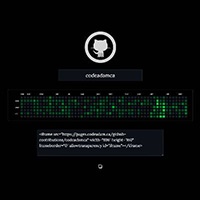

<!-- Command Shift V on a Mac -->
<!-- Ctrl Shift V opn a PC -->

# My Markdown Portfolio

## Welcome

Welcome to my online Markdown portfolio!

## About Me

My name is Adam. I teach code!

This text is **bold** and this is *italics*. This is ***bold and italic***.

## Employment

### Humber Polytechnic

### BrevisRefero

## Education

1. Humber College - Computer Information Systems
2. Royal Raods - Learning and Technology

## Projects

- [Live Code](https://livecode.codeadam.ca/)

    

- [GitHub Contributions Embed](https://pages.codeadam.ca/github-contributions/)

    
    

## Contact and Socials

Make sure you pick a case and stick with it. I'm using `kebab-case`.

You can have multi-line code snippets:

```javascript
let test = "Hello";
alert(test);
```

| Language    | Type         |
| ----------- | ------------ |
| PHP         | Server Side  |
| JavaScript  | Client Side  |
| Python      | Server Side  |

> Blockquote

> [!NOTE]  
> This is my note. 