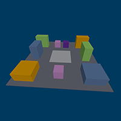

## Adam Thomas Portfolio

I Teach Code! Self-taught full-stack developer. Learning code and teaching code at Humber Polytechnic, Toronto, Canada.

### Projects

#### GitHub Contributions Embed Tools

A tool to embed a GitHub contributions grid to any web page.

[GitHub Contributions Embed Tools](https://pages.codeadam.ca/github-contributions/)

  

#### 3D Cube Puzzle

An online version of a cube puzzle built with LEGO&reg; bricks.

[3D Cube Puzzle](https://pages.codeadam.ca/cube/)

### Education

## Work Experience

***

Footer